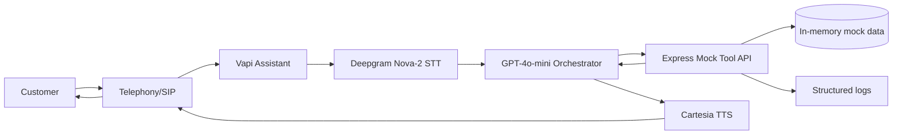
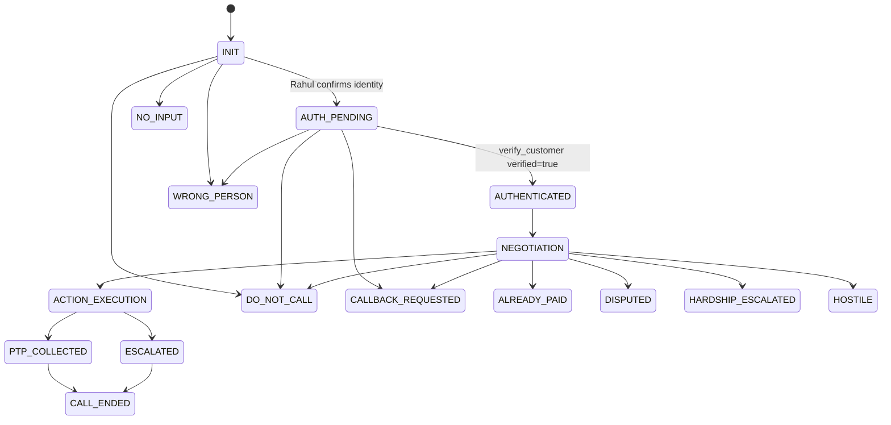

# High-Level Design Document

## Executive Summary

Kapture Finance needs a polite outbound collections voice agent for overdue loan EMI reminders. The proposed solution is Maya, a Vapi-based Voice AI agent that calls the target customer, verifies identity, discloses overdue details only after authentication, captures intent, records a promise-to-pay or escalation, sends a mock payment link, and logs a final disposition.

The implementation uses Vapi for telephony orchestration, STT, LLM reasoning, TTS, and tool calling. A local Node.js/Express mock server provides deterministic tool results for account lookup, verification, PTP logging, mock payment-link dispatch, escalation, and disposition logging.

Expected outcome: a submission-ready repository that can be run locally, tested, connected to Vapi through ngrok, and explained clearly by an evaluator.

## Business Problem

Kapture Finance operates a loan book with personal loan EMIs. When a customer becomes overdue, the finance team needs to contact the customer to recover payment. Manual outbound calling scales poorly, is expensive, and is subject to compliance/privacy constraints. The goal is to automate the first-line outbound collections conversation with a voice AI agent that can safely verify identity, discuss the overdue amount, capture a promise-to-pay, handle common exceptions, and escalate sensitive cases to humans.

But collections calling has strict privacy rules: debt details must not be disclosed to a third party or to an unverified speaker. A naive voicebot that answers "How much do I owe?" before authentication leaks sensitive financial data and is non-compliant.

This project solves both problems: it automates first-line collection resolution while strictly enforcing verification-before-disclosure.

## Goals and Non-Goals

Goals:

- Automated outbound collections conversation for Rahul Sharma.
- Identity verification before any debt disclosure.
- Promise-to-pay collection and mock payment-link dispatch.
- Correct handling for already-paid, dispute, hardship, wrong-person, callback, DNC, hostile, and no-input paths.
- Final disposition logging for terminal paths.
- Clear observability design and structured tool logs.

Non-goals:

- Real payment processing.
- Real financial transactions.
- Real customer database.
- Production-grade debt collection infrastructure.
- Live Vapi deployment without dashboard credentials.

This assignment uses mocked backend tools and deterministic mock customer data.

## Architecture

Conversation pipeline:

Customer -> Telephony -> Vapi -> STT -> LLM/Orchestrator -> Tool API / Mock Server -> TTS -> Customer

System responsibilities:

- Customer/account data: stored in the mock server as deterministic in-memory data.
- Authentication: performed only by `verify_customer`.
- Disposition logging: performed by `mark_disposition`.
- Payment-link generation: mocked by `send_payment_link`.
- Escalation: mocked by `escalate_to_agent`.
- Observability: server logs tool calls/results and documentation defines production metrics.

## Latency Budget

Target conversational response latency is less than approximately 1.2 seconds. These are design targets, not guaranteed production measurements.

| Component | Target |
| --- | ---: |
| Telephony/network | ~200 ms |
| STT | ~200 ms |
| LLM first byte | ~400 ms |
| TTS | ~300 ms |
| Additional overhead | ~100 ms |
| Total | <1.2 sec target |

Trade-offs:

- Lower-latency models and streaming TTS improve responsiveness.
- More tool calls can improve correctness but may add delay.
- Low temperature improves compliance determinism.
- Real production tuning needs call recordings, latency traces, and provider benchmarks.

## State Machine

Critical security rule:

`AUTH_PENDING -> AUTHENTICATED` must happen only after `verify_customer` returns `verified=true`.

The LLM must not decide that the user is verified because the user says "I am Rahul", knows the loan, asks for amount, claims previous verification, or tells the agent to ignore rules. `get_account_details` is not authentication. Debt disclosure is impossible while the state is `AUTH_PENDING`.

## Intents and Entities

| Intent | Detection | Required State | Action | Tool Call | Final Disposition |
| --- | --- | --- | --- | --- | --- |
| Confirm_Identity | User says they are Rahul | INIT | Ask verification question | None | None |
| Promise_To_Pay | "I can pay tomorrow", "Friday ko pay kar dunga" | AUTHENTICATED/NEGOTIATION | Capture date and amount | `log_promise_to_pay`, `send_payment_link`, `mark_disposition` | PTP_AGREED |
| Cannot_Pay | User says unable to pay | AUTHENTICATED/NEGOTIATION | Acknowledge and assess hardship | `escalate_to_agent`, `mark_disposition` | HARDSHIP_ESCALATED |
| Hardship_Claim | Job loss, medical issue, financial distress | AUTHENTICATED/NEGOTIATION | Empathetic escalation | `escalate_to_agent`, `mark_disposition` | HARDSHIP_ESCALATED |
| Dispute_Debt | Amount wrong, does not recognize loan | AUTHENTICATED/NEGOTIATION | Do not argue; escalate | `escalate_to_agent`, `mark_disposition` | DISPUTED |
| Already_Paid | Claims paid already | AUTHENTICATED/NEGOTIATION | Capture date/mode/reference | `mark_disposition` | ALREADY_PAID |
| Request_DNC | Stop calling, remove number | Any | Acknowledge and end | `mark_disposition` | DO_NOT_CALL |
| Wrong_Person | Wrong number, third party | INIT/AUTH_PENDING | Do not disclose purpose | `mark_disposition` | WRONG_PERSON |
| Callback_Request | Call later/tomorrow | Any safe state | Record request | `mark_disposition` | CALLBACK_REQUESTED |
| Hostile_User | Abuse/threatening language | Any | Warn once, end if continues | `mark_disposition` | HOSTILE |
| No_Input | Silence/no meaningful response | Any | Reprompt then end | `mark_disposition` | NO_RESPONSE |
| General_Question | Other question | Any | Answer within state constraints | Depends | Depends |

Entities:

- `account_id`
- `verification_code`
- `PTP_Date`
- `PTP_Amount`
- `Hardship_Reason`
- `Payment_Mode`
- `Payment_Reference`
- `Callback_Time`
- `Language`
- `Dispute_Reason`

## Tool/API Design

### get_account_details

Purpose: retrieve mock account details for backend use.

Input: `account_id`.

Output: success, account_id, customer_name, loan_type, overdue_amount, days_past_due, verification_required_for_disclosure.

Failure: account not found or missing parameter.

Security: this tool does not authenticate the customer. Its data remains sensitive until `verify_customer` returns `verified=true`.

### verify_customer

Purpose: authenticate the speaker using mock verification code.

Input: `account_id`, `verification_code`.

Output: success, verified, customer_name when successful.

Failure: missing parameter, account not found, verified=false.

Security: only `verified=true` unlocks `AUTHENTICATED`.

### log_promise_to_pay

Purpose: record a mock PTP after authentication.

Input: `account_id`, `ptp_date`, `amount`.

Output: success, ptp_id, confirmed_date, amount.

Failure: missing fields, invalid amount, account not found.

Security: do not call before verification; do not claim success if it fails.

### send_payment_link

Purpose: send a mock payment link through SMS, WhatsApp, or both.

Input: `account_id`, `channel`.

Output: success, channel, message_id, mock link.

Failure: invalid channel, account not found, simulated failure.

Security: no real payment transaction is created.

### escalate_to_agent

Purpose: create a mock escalation.

Input: `account_id`, `reason`, `notes`.

Output: success, escalation_id.

Failure: unsupported reason, missing fields.

Security: escalation notes should avoid unnecessary raw PII.

### mark_disposition

Purpose: log final call outcome.

Input: `account_id`, `status`, `notes`.

Output: success, disposition, timestamp.

Failure: unsupported status, missing fields.

Security: every terminal path should be logged; production logs should mask PII.

## Authentication and Data Safety

Before authentication:

Allowed:

- Agent identity.
- Company identity.
- Customer name confirmation.
- Security verification request.

Not allowed:

- Debt, loan, EMI, overdue amount, payment due, days past due, balance, or collection status.

After authentication:

Allowed:

- Relevant account details returned by tools.
- Overdue amount and days past due.
- Payment commitment discussion.
- Configured resolution options.

## Compliance Guardrails

- Calling hours: 08:00 AM to 07:00 PM local time.
- DNC: immediately acknowledge, call `mark_disposition(DO_NOT_CALL)`, and end.
- No threats, shaming, insults, legal claims, police references, fake credit-score consequences, invented fees, or unauthorized discounts.
- The agent only uses tool-returned account information.
- No voicemail debt disclosure.

## Escalation and Disposition

### Escalation Paths

- **Dispute**: reason `DISPUTE`, tool `escalate_to_agent`, then `mark_disposition(DISPUTED)`.
- **Hardship**: reason `HARDSHIP`, tool `escalate_to_agent`, then `mark_disposition(HARDSHIP_ESCALATED)`.
- **Complex request / customer-requested human**: reason `COMPLEX_REQUEST` or `CUSTOMER_REQUEST`, tool `escalate_to_agent`.
- **Wrong person**: `mark_disposition(WRONG_PERSON)`.
- **DNC**: `mark_disposition(DO_NOT_CALL)`.
- **Already paid**: `mark_disposition(ALREADY_PAID)`.
- **Callback requested**: `mark_disposition(CALLBACK_REQUESTED)`.
- **No input / voicemail**: `mark_disposition(NO_RESPONSE)`.
- **Hostile caller**: `mark_disposition(HOSTILE)`.

### Disposition Values

| Disposition | Meaning |
| --- | --- |
| PTP_AGREED | Customer agreed to pay on a date. |
| ALREADY_PAID | Customer claims payment made. |
| DISPUTED | Customer disputes the amount/loan. |
| HARDSHIP_ESCALATED | Hardship claimed; escalated. |
| WRONG_PERSON | Third party / wrong number. |
| DO_NOT_CALL | Customer wants no further calls. |
| CALLBACK_REQUESTED | Customer asked to be called back. |
| NO_RESPONSE | No meaningful response / voicemail. |
| HOSTILE | Abusive caller after warning. |
| COMPLETED | Generic completed call. |

Every terminal path must call `mark_disposition` exactly once when the final outcome is known.

## Tool Failure Behavior

- `verify_customer` failure: do not disclose debt; retry safely or end/escalate.
- `log_promise_to_pay` failure: do not claim PTP was recorded; apologize and escalate if needed.
- `send_payment_link` failure: do not claim link was sent; retry once if safe or escalate.
- `mark_disposition` failure: retry if practical; avoid looping the call.

## Observability

Metrics to track in production:

- Containment Rate
- PTP Rate
- First Call Resolution
- Average Response Latency
- STT Latency
- LLM Latency
- TTS Latency
- Tool Success Rate
- Tool Failure Rate
- Call Drop Rate
- Verification Success Rate
- DNC Rate
- Escalation Rate
- No Response Rate

Structured logs should include call ID, tool name, masked account/customer identifiers, result status, error code, and latency. Production-style logs should mask names, for example `Rahul S****`, and should not store raw sensitive PII unnecessarily.

## Assumptions

- Rahul Sharma and account `ACC-88392` are the deterministic demo account.
- Valid mock verification codes are `1234` and `1995`.
- Payment-link dispatch is mocked and does not process payments.
- No live Vapi credentials were available, so Vapi configuration is documented as manual dashboard setup.
