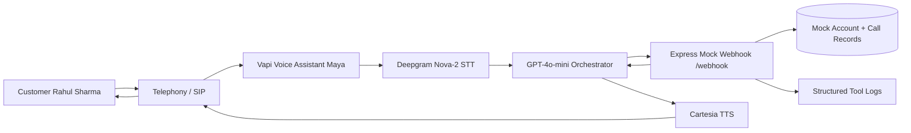
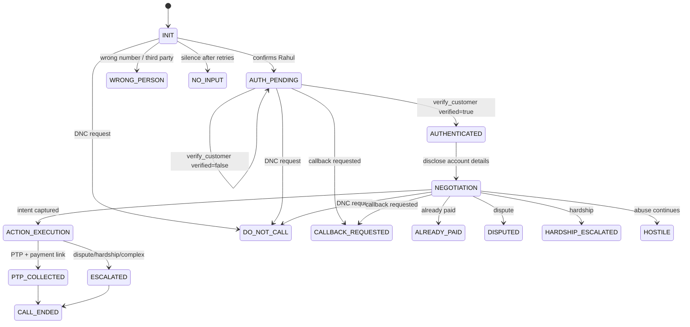
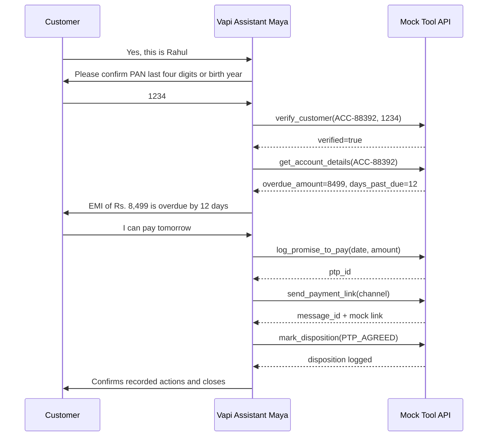

# System Architecture

## System Architecture

```mermaid
flowchart LR
  Customer[Customer Rahul Sharma] --> Phone[Telephony / SIP]
  Phone --> Vapi[Vapi Voice Assistant Maya]
  Vapi --> STT[Deepgram Nova-2 STT]
  STT --> LLM[GPT-4o-mini Orchestrator]
  LLM --> Tools[Express Mock Webhook /webhook]
  Tools --> Data[(Mock Account + Call Records)]
  Tools --> Logs[Structured Tool Logs]
  Tools --> LLM
  LLM --> TTS[Cartesia TTS]
  TTS --> Phone
  Phone --> Customer
```

## Conversation State Machine

```mermaid
stateDiagram-v2
  [*] --> INIT
  INIT --> AUTH_PENDING: confirms Rahul
  AUTH_PENDING --> AUTHENTICATED: verify_customer verified=true
  AUTH_PENDING --> AUTH_PENDING: verify_customer verified=false
  AUTHENTICATED --> NEGOTIATION: disclose account details
  NEGOTIATION --> ACTION_EXECUTION: intent captured
  ACTION_EXECUTION --> PTP_COLLECTED: PTP + payment link
  ACTION_EXECUTION --> ESCALATED: dispute/hardship/complex
  PTP_COLLECTED --> CALL_ENDED
  ESCALATED --> CALL_ENDED

  INIT --> WRONG_PERSON: wrong number / third party
  INIT --> DO_NOT_CALL: DNC request
  AUTH_PENDING --> DO_NOT_CALL: DNC request
  NEGOTIATION --> DO_NOT_CALL: DNC request
  AUTH_PENDING --> CALLBACK_REQUESTED: callback requested
  NEGOTIATION --> CALLBACK_REQUESTED: callback requested
  NEGOTIATION --> ALREADY_PAID: already paid
  NEGOTIATION --> DISPUTED: dispute
  NEGOTIATION --> HARDSHIP_ESCALATED: hardship
  INIT --> NO_INPUT: silence after retries
  NEGOTIATION --> HOSTILE: abuse continues
```

## Tool Interaction Sequence

```mermaid
sequenceDiagram
  participant Customer
  participant Maya as Vapi Assistant Maya
  participant ToolAPI as Mock Tool API

  Customer->>Maya: Yes, this is Rahul
  Maya->>Customer: Please confirm PAN last four digits or birth year
  Customer->>Maya: 1234
  Maya->>ToolAPI: verify_customer(ACC-88392, 1234)
  ToolAPI-->>Maya: verified=true
  Maya->>ToolAPI: get_account_details(ACC-88392)
  ToolAPI-->>Maya: overdue_amount=8499, days_past_due=12
  Maya->>Customer: EMI of Rs. 8,499 is overdue by 12 days
  Customer->>Maya: I can pay tomorrow
  Maya->>ToolAPI: log_promise_to_pay(date, amount)
  ToolAPI-->>Maya: ptp_id
  Maya->>ToolAPI: send_payment_link(channel)
  ToolAPI-->>Maya: message_id + mock link
  Maya->>ToolAPI: mark_disposition(PTP_AGREED)
  ToolAPI-->>Maya: disposition logged
  Maya->>Customer: Confirms recorded actions and closes
```
